# Immo_Eliza

## Data_Scrapping

## Data_Analysis

## Data analysis of the data scrapped from immo web site

### Main jupyter note book

- Clean the dataset  
- Remove unnecessary datas  
- Adding new columns regarding the purpose of the analysis ( price per square meter)
- Remove outliers
- Plot data and regression model using SeaBorn library:

#### Price per square meters vs price

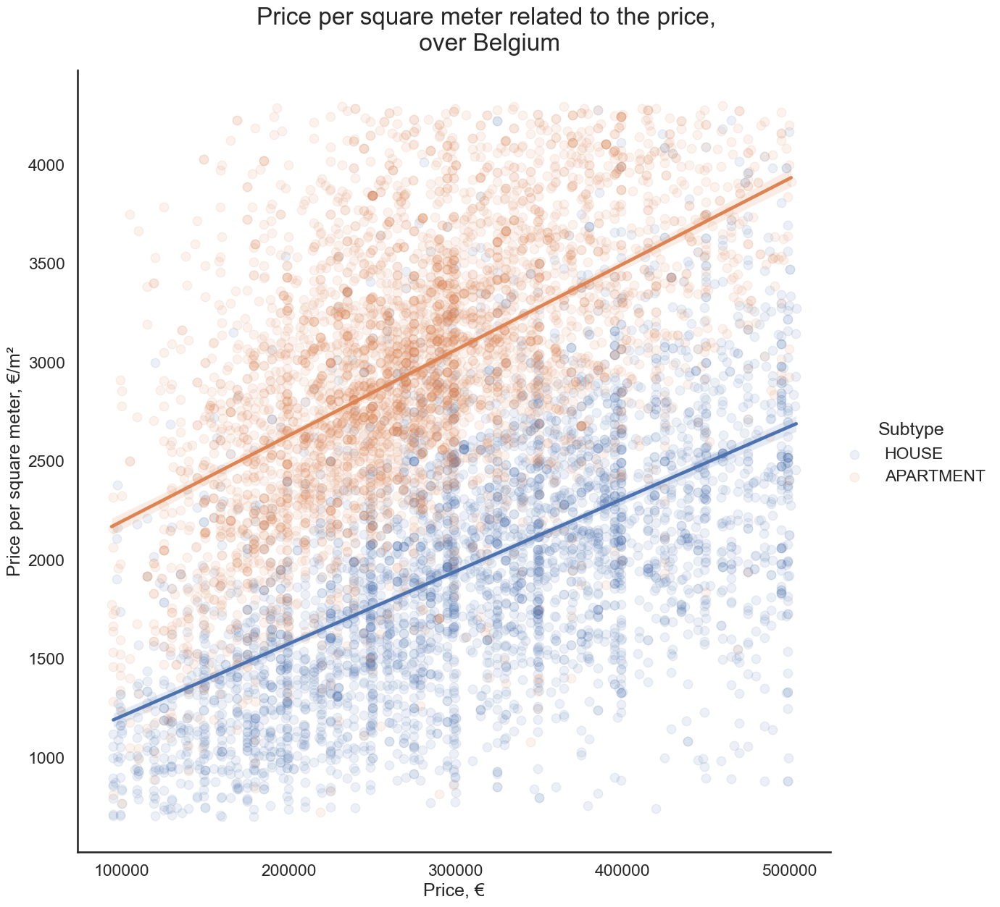  

### Mapzip jupyter notebook

- From open data Wallonie-Bruxelles website, download csv and geojson files containing zip code and geometry for Belgiuum
- Based on those files, create a dictionary storing localities and zip codes.
- Add a new column in my dataframe to map the zip code for each row.
- Group my dataframe by zip code
- Add a new column, giving me the mean price per square meter for each zip code.
- Save the result in csv format: zip_price_sqm_meters.csv

### Map_belgium jupyter notebook

- Add column in the zip code geojson file, with mean price per zipcode, from the zip_price_sqm_meters.csv created from previous notebook.  
- With the use of GEOPANDAS, display the map of belgium, showing the mean price per square meter.
- color scaling each city accordingly.
- Due to lack of naming convention on the immo website, mapping of the localities, zipcode led to loss of relevant datas
- The coverage of the map shows empty areas
- Solution found to solve this issue, but no time to implement in the given time. (Improve scrapping process according to the result to achieve, work on the data from the zip code geojson file, to improve mapping of localities, zip code, provinces...)

#### Belgium map mean price per square meters  

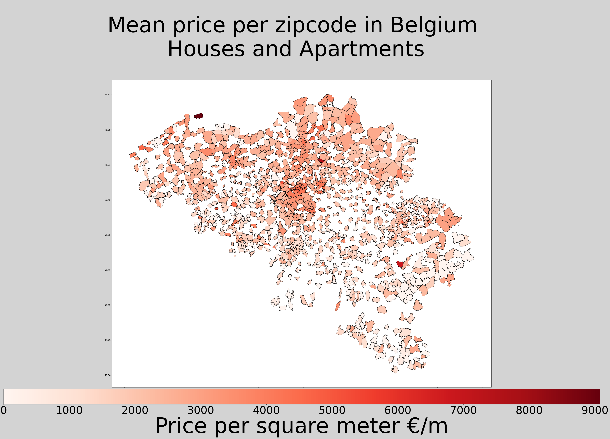

## Data Modeling

### Modeling the price of houses across Belgium

From the datas collected, try to model the price of houses across Belgium.

#### Data Cleaning

- load the datas from csv file.  
- adding columns for zip code, province and region.  
- Ensure the type of each column is consistent  

#### Correlation

- Explore Correlation between features  
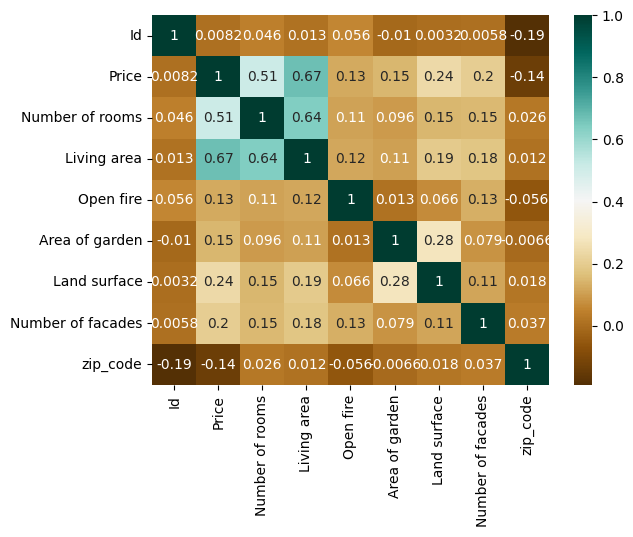
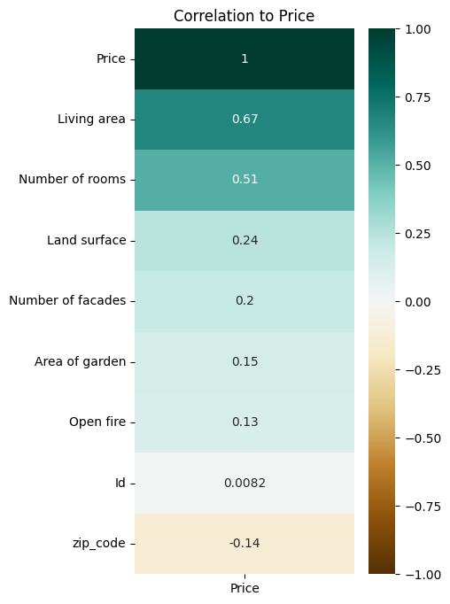

#### Manage outliers

Remove outliers.  
State of the dataset before and after removing outliers on price for example:
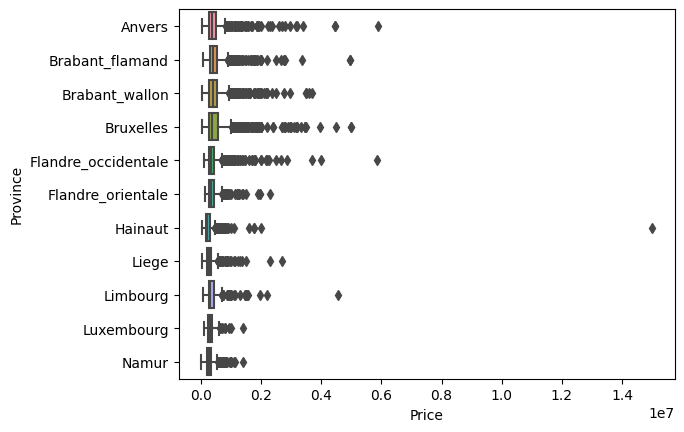
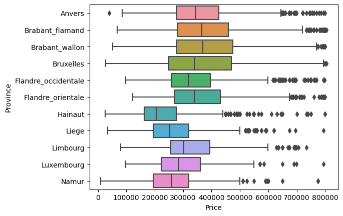

#### Select target and features for modeling

-Target: House price  
-Features: selected according to correlation  
-Convert categorical variable into dummy/indicator variables  
-Different type of normalisation tested  

#### Linear Regression

Regressor used : LinearRegression and GradientBoostingRegressor from sklearn

Results:  
Regressor score

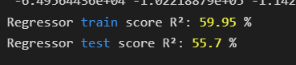 

Metrics
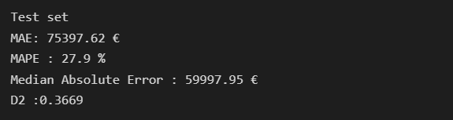  

Regression line Price vs Living area and number of rooms  

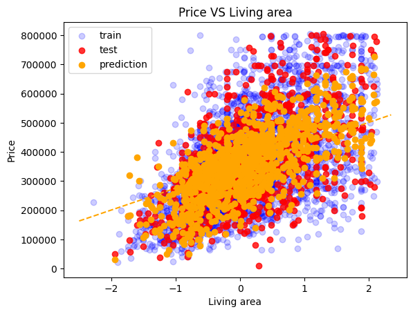
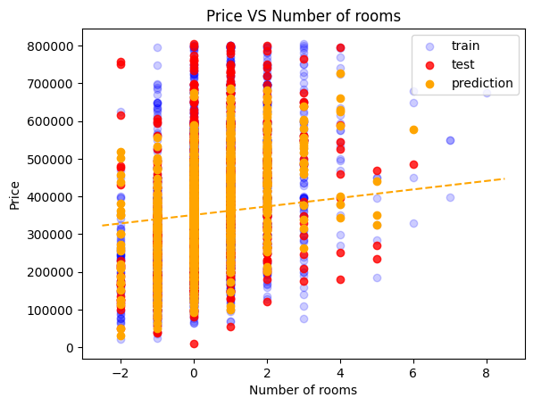  

Cross validation  
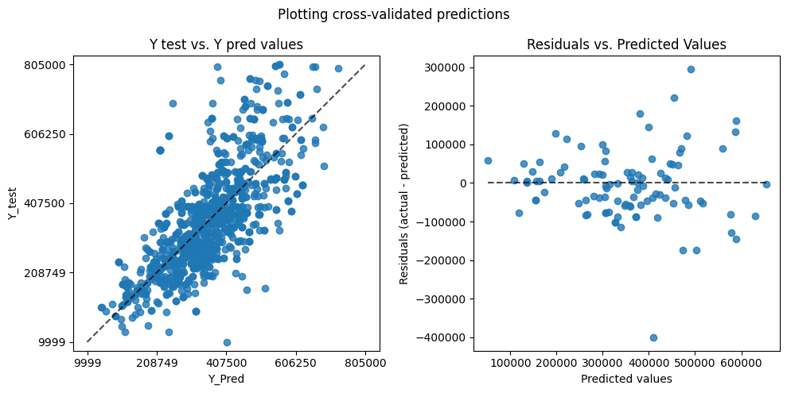  
